# 1.基本范例

>- 模板的定义是以 `template` 关键字开头。
>- 类型模板参数T前面用 `typename` 来修饰 , 所以 , 遇到 `typename` 就该知道其后面跟的是一个类型。
>   - `typename` 可以被 `class` 取代 , 但此处的 `class` 并没有“类”
>- 类型模板参数T (代表是一个类型) 以前前面的修饰符 `typename/class` 都用 `<>` 括起来
>- T这个名字可以换成任意其他标识符 , 对程序没有 影响。用T只是一种编程习惯。
>


## 1.1 编程实验

[[]]()

>```c++
>#include <iostream>
>#include <string>
>
>using namespace std;
>
>namespace nmsp1_
>{
>	//template<typename T> /*T:称为 类型 模板参数 ，代表是一个类型*/
>	template<class T> /*class 可以取代typename，但这里的class并没有 “类” 的意思*/
>										/*T这个名字可以任意起*/
>	T Sub(T tv1, T tv2)
>	{
>		return tv1 - tv2;
>	}
>
>}
>
>int main(int argc, char* argv[])
>{
>	int subv{ nmsp1_::Sub(3,5) };
>	cout << "subv = " << subv << '\n';
>	double subv2{ nmsp1_::Sub(4.7,3.1) };
>	cout << "subv2 = " << subv2 << '\n';
>
>	//string a("abc"),b("def");
>	//string addresult {nmsp1_::Sub(a,b)}; /*编译出错,模板无法推导*/
>
>	return 0;
>}
>```
>
>
>
>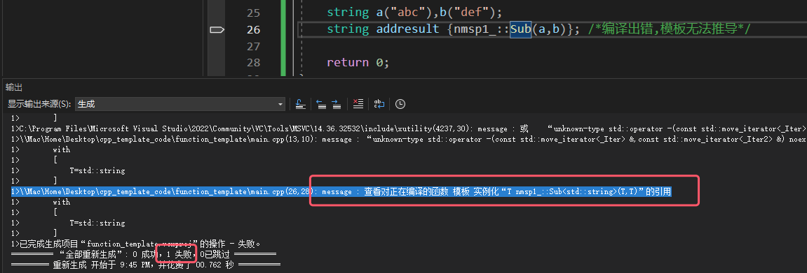

# 2.实例化

>- 编译时,用具体的 "类型" 代替 "类型模板参数" 的过程就叫做实例化 (有人也叫代码生成器)。
>   - .obj文件在编译完成后就会产生
>   - .obj文件的格式一般会被认为是一种COFF——通用对象文件格式 (Common Object File Format) 。
>
>- `int  Sub<int>(int,int)` `double Sub<double>(double,double)`
>   - 实例化之后的函数名分别叫做Sub<int>和Sub<double>
>
>- 通过函数模板实例化之后的函数名包含三部分 : 
>   - 模板名;
>   - 后面跟着一对<>; 
>   - <>中间是一个或多个具体类型(本次实验只有一个类型)。
>
>- 编译期间 : 
>   - 在编译阶段 , 编译器就会查看函数模板的 函数体 部分 , 来确定能否针对该类型 (实验的类型为string) 进行Sub函数模板的实例化。
>   - 在编译阶段 , 编译器需要能够找到函数模板的函数体部分。
>
>
>[[参考代码(还没放链接)]]()

## 2.1 可视化.obj文件实验

>1. 重新编译,确保编译成功 (编译成功很重要,没有编译成功无法生成obj文件) 
>
>2. 打开Developer Command Prompt 或 (Developer PowerShell ) 工具
>
> 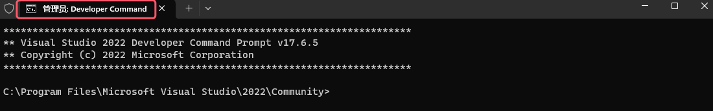
>
> 
>
>3. 在Developer PowerShell 进入带有.obj的文件目录
>
>4. 输入 `dumpbin.exe /all .\*.obj > *.txt` (第一个 `*` 代表obj文件名,第二个 `*` 代表输出文件的名)
>
> 
>
>5. `dumpbin.exe` 这个工具把obj文件转换成可视化的txt文件
>
>6. 在输出文件txt中通过搜索可以得到相关信息(本次实验搜索关键字是Sub模板函数相关的实例化函数信息)
>
> 
>
> 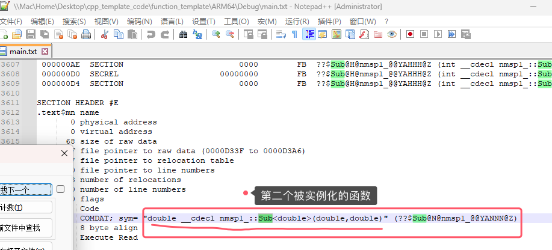

## 2.2 精确匹配类型

>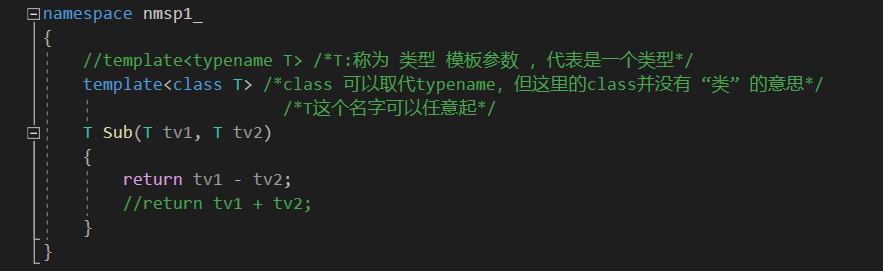
>
>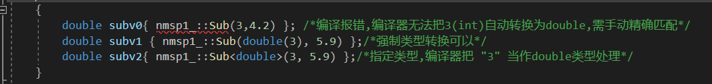
>
>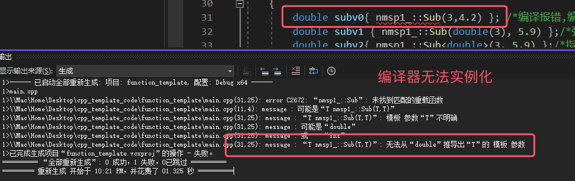
>
>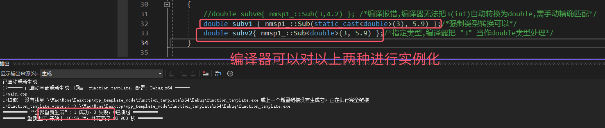

# 3.模板参数的推断

## 3.1 常规的参数推断

>- 通过 `<>` 可以只指定一部分模板参数的类型 , 另外一部分模板参数的类型可以通过调用时给的实参来推断
>- `auto` 代替函数模板返回类型
>   - `decltype` ,可以与 `auto` 结合使用来构成返回类型后置语法
>   - 这种后置语法其实也就是使用 `auto` 和 `decltype` 结合来完成返回值类型的推导

### 3.1.1 编程实验

[[]]()

>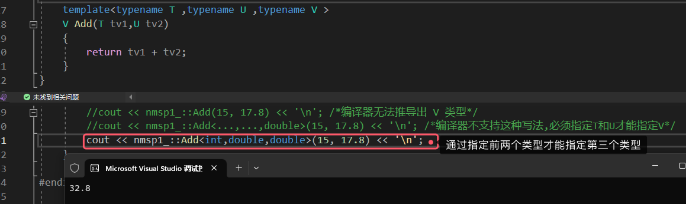
>
>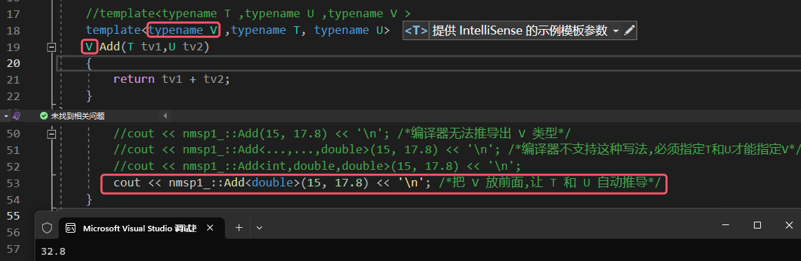
>
>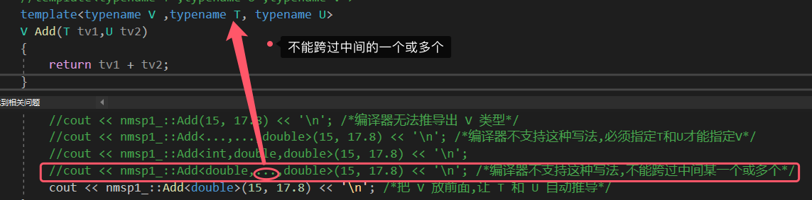
>
>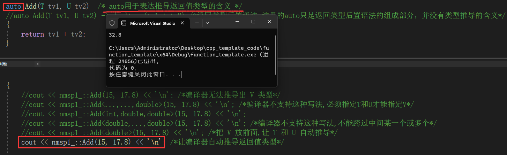
>
>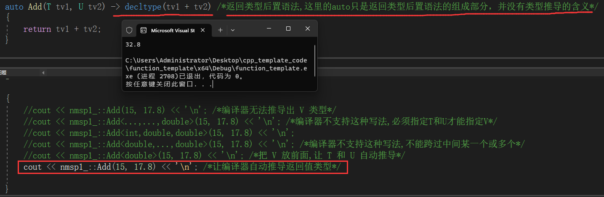

## 3.2 各种推断的比较以及空模板参数列表的推断

>1. 自动推断
>2. 指定类型模板参数,优先级比自动推断高
>3. 指定空模板参数列表<> : 
>    1. 作用就是请调用mydouble函数模板而不是调用普通的mydouble函数。

### 3.2.1 编程实验

>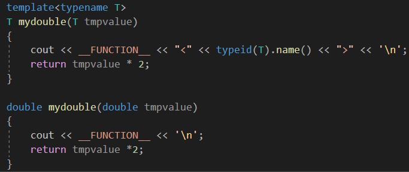
>
>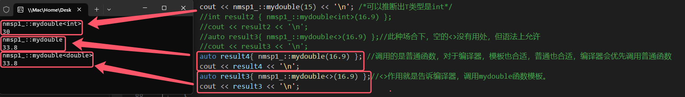

# 4.重载

>- 函数 (函数模板) 名字相同 , 但是 参数数量 或者 参数类型 上不同
>- 函数模板和函数也可以同时存在 , 此时可以把函数看成是一种重载 , 当普通函数和函数模板都比较合适的时候 , 编译器会 **优先选择** 普通函数来执行
>- 如果选择最合适 (最特殊) 的 函数模板/函数 , 编译器内部有比较复杂的排序规则 , 规则也在不断更新。

## 4.1 实验

[[]]()

>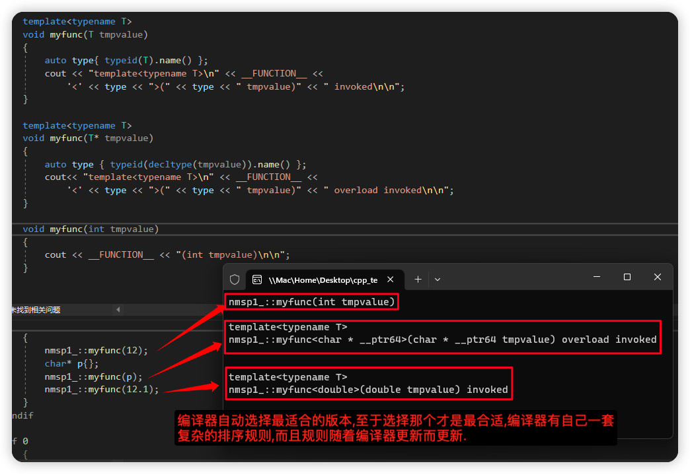

# 5.特化

>- 泛化 (泛化版本) : 大众化的, 常规的。常规情况下,写的函数模板都是泛化的函数模板。
>
>- 特化 (特化版本) : 往往代表着从泛化版本中抽出来的一组子集。
>

## 5.1 全特化

>1. 全特化 : 就是把tfunc这个泛化版本中的所有模板参数都用具体的类型来代替构成的一个特殊的版本 (全特化版本)；
>
>   1. 全特化实际上等价于实例化一个函数模板，并不等价于一个函数重载。
>      1. void tfunc<int ,double>(int& tmprv, double& tmprv2){......}  全特化的样子
>       2. void tfunc(int& tmprv, double& tmprv2) { ...... }  重载函数的样子
>
>    2. 编译器考虑的顺序 : 优先选择普通函数 , 然后才会考虑函数模板的特化版本 , 最后才会考虑函数模板的泛化版本。
> 

### 5.1.1 实验

[[]]()

>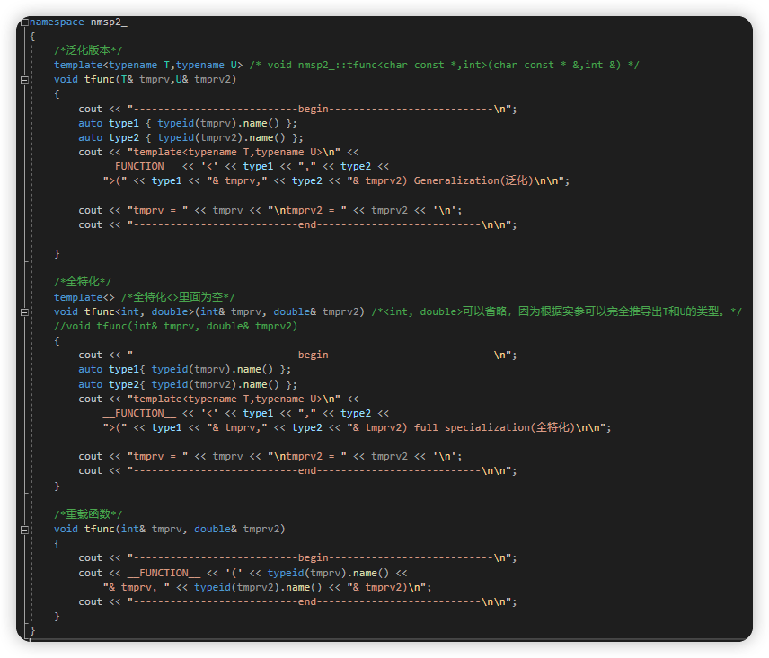
>
>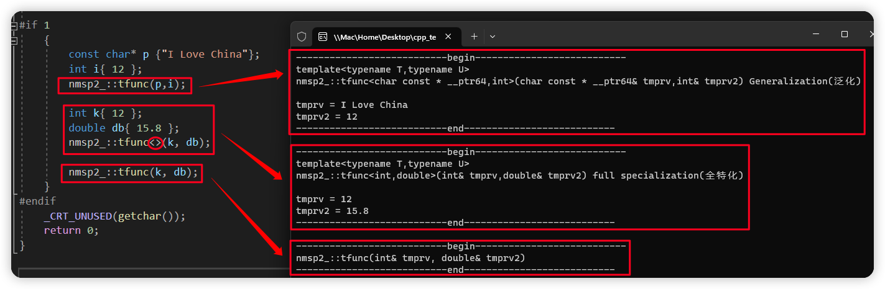

## 5.2 偏特化 (局部特化)

>1. 从两方面来说 : 一个是模板参数数量上的偏特化 , 一个是模板参数范围上的偏特化。
>
>2. 模板参数数量上的偏特化 : 
>
>   - 比如针对tfunc函数模板 , 第一个模板参数类型为double , 第二个模板参数不特化；
>   - 实际上 , 从模板参数数量上来讲 , 函数模板不能偏特化。否则会导致编译错误。
>
>3. 模板参数范围上的偏特化 : 
>
>   - 范围上 : int->const int , 类型变小；   T->T* , T->T& , T->T&&。针对T类型 , 从类型范围上都变小了。
>   - 实际上 , 对于函数模板来讲 , 也不存在模板参数范围上的偏特化。因为这种所谓模板参数范围上的偏特化 , 实际上是函数模板的重载。
>
>4. 通过重载实现模板参数数量上的偏特化
>5. 后续讲解类模板时 , 对于类模板 , 还是存在模板参数范围上的偏特化以及数量上的偏特化 , 后续会详细讲解。

### 5.2.1 实验

[[]]()

>
>
>
