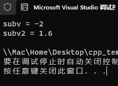
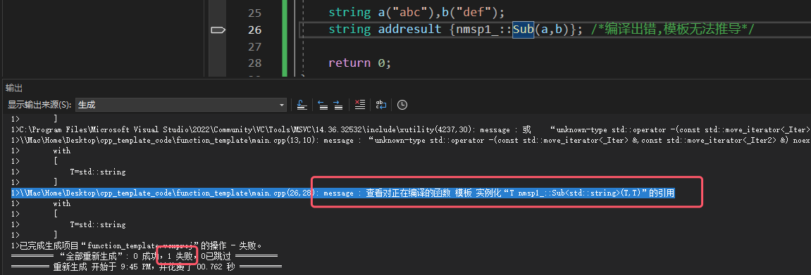
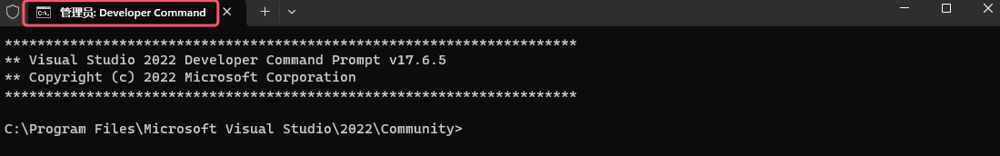
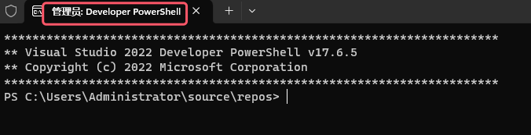
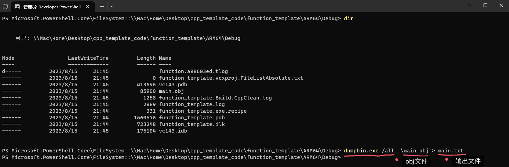
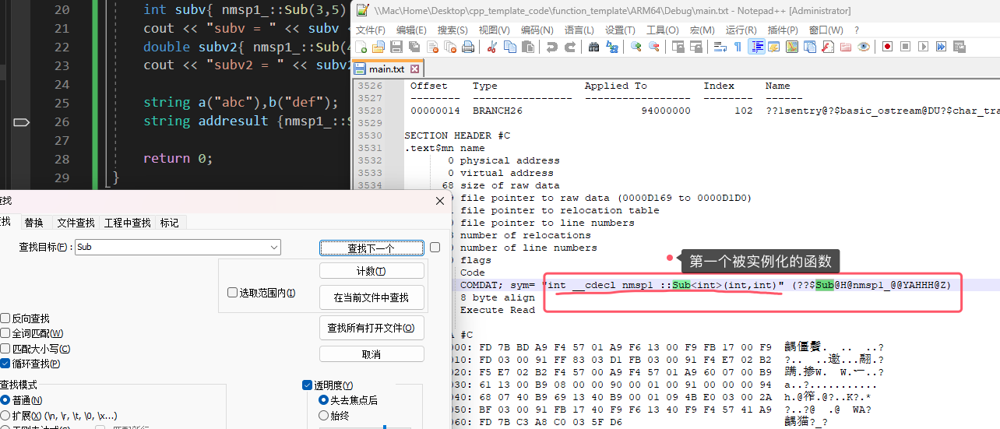
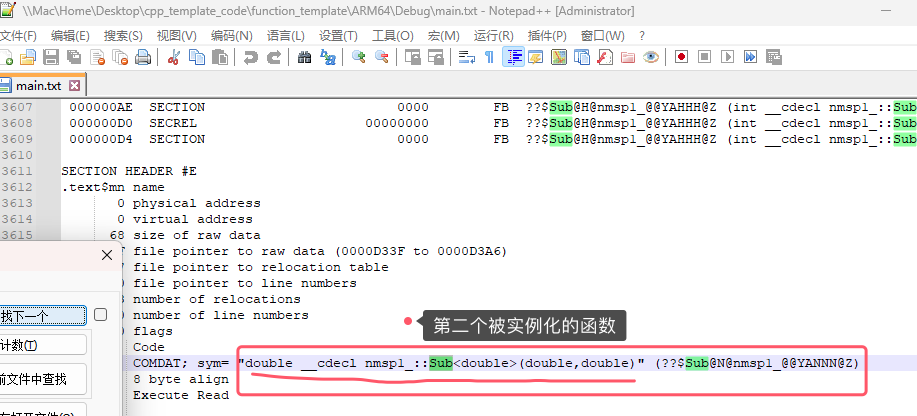

# 1.基本范例

>- 模板的定义是以 `template` 关键字开头。
>- 类型模板参数T前面用 `typename` 来修饰 , 所以 , 遇到 `typename` 就该知道其后面跟的是一个类型。
>   - `typename` 可以被 `class` 取代 , 但此处的 `class` 并没有“类”
>- 类型模板参数T (代表是一个类型) 以前前面的修饰符 `typename/class` 都用 `<>` 括起来
>- T这个名字可以换成任意其他标识符 , 对程序没有 影响。用T只是一种编程习惯。
>
>[[参考代码(还没放链接)]]()

## 1.1 编程实验

>```c++
>#include <iostream>
>#include <string>
>
>using namespace std;
>
>namespace nmsp1_
>{
>	//template<typename T> /*T:称为 类型 模板参数 ，代表是一个类型*/
>	template<class T> /*class 可以取代typename，但这里的class并没有 “类” 的意思*/
>										/*T这个名字可以任意起*/
>	T Sub(T tv1, T tv2)
>	{
>		return tv1 - tv2;
>	}
>
>}
>
>int main(int argc, char* argv[])
>{
>	int subv{ nmsp1_::Sub(3,5) };
>	cout << "subv = " << subv << '\n';
>	double subv2{ nmsp1_::Sub(4.7,3.1) };
>	cout << "subv2 = " << subv2 << '\n';
>
>	//string a("abc"),b("def");
>	//string addresult {nmsp1_::Sub(a,b)}; /*编译出错,模板无法推导*/
>
>	return 0;
>}
>```
>
>
>
>

# 2.实例化

>- 编译时,用具体的 "类型" 代替 "类型模板参数" 的过程就叫做实例化 (有人也叫代码生成器)。
>  - .obj文件在编译完成后就会产生
>  - .obj文件的格式一般会被认为是一种COFF——通用对象文件格式 (Common Object File Format) 。
>
>- `int  Sub<int>(int,int)` `double Sub<double>(double,double)`
>  - 实例化之后的函数名分别叫做Sub<int>和Sub<double>
>
>- 通过函数模板实例化之后的函数名包含三部分 : 
>  - 模板名;
>  - 后面跟着一对<>; 
>  - <>中间是一个或多个具体类型(本次实验只有一个类型)。
>
>- 编译期间 : 
>  - 在编译阶段 , 编译器就会查看函数模板的 函数体 部分 , 来确定能否针对该类型 (实验的类型为string) 进行Sub函数模板的实例化。
>  - 在编译阶段 , 编译器需要能够找到函数模板的函数体部分。
>
>[[参考代码(还没放链接)]]()

## 2.1 实验

>1. 重新编译,确保编译成功 (编译成功很重要,没有编译成功无法生成obj文件) 
>
>2. 打开Developer Command Prompt 或 (Developer PowerShell ) 工具
>
>   
>
>   
>
>3. 在Developer PowerShell 进入带有.obj的文件目录
>
>4. 输入 `dumpbin.exe /all .\*.obj > *.txt` (第一个 `*` 代表obj文件名,第二个 `*` 代表输出文件的名)
>
>   
>
>5. `dumpbin.exe` 这个工具把obj文件转换成可视化的txt文件
>
>6. 在输出文件txt中通过搜索可以得到相关信息(本次实验搜索关键字是Sub模板函数相关的实例化函数信息)
>
>   
>
>   

